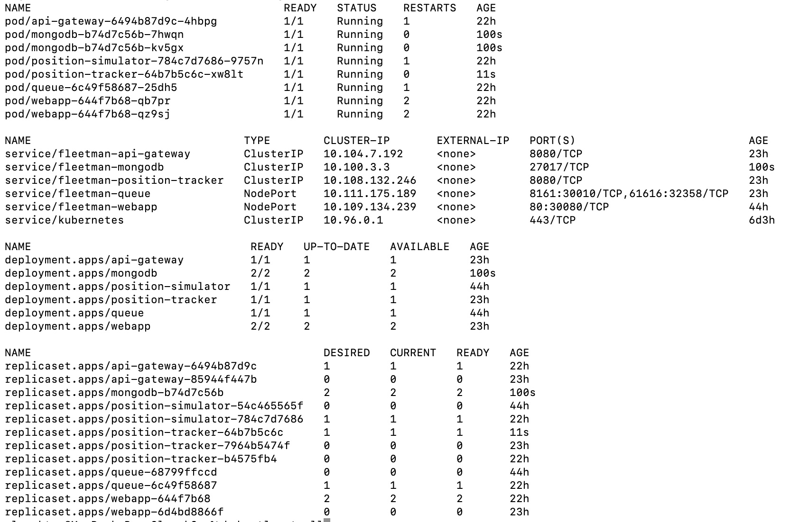
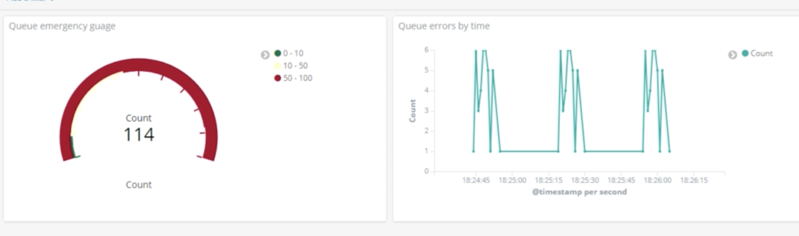

###### Learning Kubernates <br>

###### Microservices Project

Steps:

# 1. Preparation

install minikube (inkl kubectl, virtualbox) <br>
make docker commandline work with minikube's docker daemon <br>
minikube docker-env <br>
eval $(minikube -p minikube docker-env) - every command line <br>

# 2. Docker

pull image of frontend microservice <br>
docker image pull richardchesterwood/k8s-fleetman-webapp-angular:release0-5\n <br>
run container <br>
docker container run -p 8080:80 -d richardchesterwood/k8s-fleetman-webapp-angular:release0-5\n <br>
to access in browser check minikubes ip <br>
minikube ip <br>
kubernates <br>
pod - the most basic unit of deployment. usually one docker container - one pod. <br>

# 3. Pod

create a yaml file for pod <br>

```
kubectl apply -f first-pod.yaml
kubectl apply -f . // all files
kubectl get all
kubectl describe pod/webapp // status info
kubectl exec webapp -- ls // show contents of the folder
kubectl -it exec webapp sh // open shell inside of contasiner
wget http://localhost:80 // request local server inside container
cat index.html // read file inside shell
```

if need delete: kubectl delete po webapp

# 4. Service

create a yaml file for service with selector for pod <br>

```
kubectl apply -f webapp-service.yaml >
```

add field labels in the pod's yaml metadata matching the services selector (any key/value pair) <br>
apply changes <br>
check browser http://192.168.99.100:30080 (minikube ip and port from yaml which should be greater than 30tsd) <br>

```
kubectl get po --show-labels
kubectl get po --show-labels -l release=0
```

# 5. ReplicaSet

If a pod dies for some reason, replicaset will bring up a new one (or how many replicas were indicated) <br>
Edit pod: put existing description under "template" field. Change Kind to Replicaset, version to apps/v1, add replica quantity, selector and name. <br>

```
kubectl delete pods --all
kubectl apply -f .
kubectl get all
```

ReplicaSet creates a pod (or several pods, depends on how many replicas are desired) with a made-up name. If one pod crashes, another one is running and a new one is being created<br>

```
kubectl describe rs webapp
```

# 6. Deployments

Deployment is more advanced than ReplicaSet, it creates a new replicaset (name + -random id) which creates pods (name + -random id + -random id)<br>
Deployment supports rollback (last 10 revisions), because it doesn't delete replicaset, just sets raplicas quantity to zero (if the new replica is healthy and in ready state). No downtime<br >
kubectl delete rs webapp <br>
In pods.yaml change the kind to Deployment<br>

```
kubectl apply -f pods.yaml
```

Change the docker image in pod to new release and apply.<br>

```
kubectl rollout status deployment webapp
kubectl rollout history deployment webapp
kubectl rollout undo deployment webapp --to-revision=2
```

But after rollback the yaml files don`t match the real situation! Use only in emergency<br>

# 7. Connecting containers, Service discovery (ex. backend+ DB)

Backend App = Pod + Service<br>
DB = Pod + Service<br>
Kube DNS Service = key (pod name) &value (ip address) pairs<br>
Namespaces are like packages<br>
default namespace<br>

```
kubectl get namespaces // ns
kubectl get all -n kube-system // shows kube dns service
```

Create pod and service(ClusterIP) for mysql, apply<br>

```
kubectl exec -it pod/webapp-5f97db5744-gwg76 sh
cat /etc/resolv.conf // shows namespace ip
nslookup database // shows ip of the service named database
```

install msql client inside docker container:<br>

```
apk update
apk add mysql-client
mysql -h database -uroot -ppassword fleetman
```

Fully qualified domain names: database. default.svc.cluster.local<br>

# 8. Microservices Architecture

A system for a transport company: Vehicles report their current position every 10sec to a server.<br>
Backend Part:<br>
1)Position Simulator Microservice (simulates real vehicles, reads data from files in infinite loop)<br>
2)Active MQ Microservice<br>
3)Posiotion Traker Microservice reads positions from Acrive MQ, calculates speed, keeps history<br>
Frontend<br>
4)Angular App<br>
"Middle"<br>
5)API Gateway - single point of entry for frontend, delegates calls to backend

```
kubectl delete -f .
```

deploy queue as Deployment with 1 replicas, port: 61616<br>
deploy position-simulator as Deployment with 1 replicas, an env variable. no service needed because it only sends messages to queue<br>

### Logs

```
kubectl logs pod-name<br>
kubectl logs -f pod-name // follow logs
```

deploy position tracker as Deployment with a Service type ClusterIP. It starts consuming messages from ActiveMQ. Change type to NodePort to check REST API http://192.168.99.100:30020/vehicles/ // minukubeIp:nodePort/ <br>
In the Spring app properties set are spring.activemq.broker-url=tcp://fleetman-queue:61616 // deploymentName:port<br>
Deploy api gateway as Deployment with a Service type ClusterIP.<br>
Deploy angular webapp as Deployment with a Service type NodePort. <br>

# 9. Persistance

Add mongo stack (deployment + service ClusteIP) with official mongo docker image<br>
Update release tags.<br>



In order to persist data even if mongo pod crashes we need to copy data to a folder on te host machine.<br>
Add volumeMounts to the mongo container's spec, with a mountPath: /data/db<br>
Add volumes field after containers with hostPath: with type: DirectoryOrCreate and some path in virtual box (ex /mnt)<br>
To check if files were copied open VirtualBox, double click to open terminal, login under docker tcuser, go cd / than ls<br>
Move volume config to separate yaml with persistentVolumeClaim + persistentVolume, which are binded by the same storageClassName (accessmode should be the same, storage same or bigger in pv)<br>

```
kubectl get pv
kubectl get pvc
```

# 10. From minikube to AWS

Create account<br>
Node is a fisical server (called ec2 instance)<br>
Master node is responsible for scheduling nodes<br>
Ebs - persistent volume<br>

### Kops

Kops - Kubernates Operations sets up a production k8s cluster<br>
Insead of running kops on local machine set Linux instance in AWS<br>
In AWS launch instance - Amazon Linux 2 AMI (the smallest), add tag (name-bootstrap), in security select source my ip, create key pair and download. View instances, copy the public api. Open your computer terminal, copy the key pair into the folder with k8s project.<br>
To login run: ssh -i keypair.pem ec2-user@<copied ip address here><br>
(may be needed: chmod go-rwx keypair.pem)<br>
https://kops.sigs.k8s.io/getting_started/install/<br>

```
curl -Lo kops https://github.com/kubernetes/kops/releases/download/$(curl -s https://api.github.com/repos/kubernetes/kops/releases/latest | grep tag_name | cut -d '"' -f 4)/kops-linux-amd64
chmod +x kops
sudo mv kops /usr/local/bin/kops
```

Kubectl<br>
https://kubernetes.io/docs/tasks/tools/install-kubectl-linux/#install-kubectl-binary-with-curl-on-linux<br>
curl -LO "https://dl.k8s.io/release/$(curl -L -s https://dl.k8s.io/release/stable.txt)/bin/linux/amd64/kubectl"<br>
sudo install -o root -g root -m 0755 kubectl /usr/local/bin/kubectl<br>
kubectl version --client<br>

Setup IAM User<br>
In command line:<br>
aws iam create-group --group-name kops + other commands<br>
https://kops.sigs.k8s.io/getting_started/aws/<br>
Or in UI: services menu -> IAM (under Security) - Groups - Create new Group "kops" - select needed policies - create group. Under Users - Add User "kops", access type "programmatic access" - Permissions add user to Group "kops". Access key id, Secret access key.<br>
Run: aws configure // enter keys here<br>
Select region (in UI go to Services -EC2 - in upper right corner select region, search in docs for the correct corresponding name like eu-west-2)<br>

```
aws iam list-users
export AWS_ACCESS_KEY_ID=$(aws configure get aws_access_key_id)
export AWS_SECRET_ACCESS_KEY=$(aws configure get aws_secret_access_key)
```

Skip DNS section (not needed in recent versions)<br>

State storage<br>
Setup S3 Bucket to store data in kops<br>
In UI - Services - S3 - Create bucket (with a globally unique name like yourname-state-storage)<br>

Create cluster<br>
Env variables:<br>

```
export NAME=fleetman.k8s.local //use k8s.local!
export KOPS_STATE_STORE=s3://yourname-state-store
```

Cluster configuration: <br>
Check your availability zones (there are 2-4 datacenters in each region): aws ec2 describe-availability-zones --region us-west-1<br>
Add all zones to config comma separated:<br>

```
kops create cluster --zones [zones here] ${NAME}
ssh-keygen -b 2048 -t rsa -f ~/.ssh/id_rsa
kops create secret --name ${NAME} sshpublickey admin -i ~/.ssh/id_rsa.pub
show cluster config: kops edit cluster ${NAME} // opens vi editor, change it "export EDITOR=nano"
kops edit ig nodes --name ${NAME} // ig = instance groups, shows type t2.medium, minsize 2 -> change minsize=3, maxsize=5
kops get ig --name ${NAME}
```

Run Cluster<br>

```
kops update cluster ${NAME} --yes // with this command costs start!! delete resources after usage
kops validate cluster // wait several minutes until no errors appear
kops get nodes --show-labels
```

In AWS UI - Services - EC2 instances list: bootstrap, master, nodes, nodes, nodes. In the menu "Load Balances" a new LB appeared with a dns name (it costs 3 cents per hour). "kubectl get all" calls the load balancer, which is pointing to the master instance, if it crashes a new master will be created.<br>
Menu - Autoscaling Group (if one node crashes a new one gets created)<br>

# 11. Deployment to AWS

To copy local files to AWS use nano inside aws console. // better use git!<br>
storage-aws.yaml<br>
In storage.yaml change the persistent volume to StorageClass than kuctl apply -f storage-aws.yaml<br>
kubectl get pv // a volume was created with reclaim policy Delete (if there is important data, change it)<br>
(AWS UI menu - Elastic Block Store - Volumes)<br>

```
nano mongo-stack.yaml // copy than apply
kubectl get all
kubectl describe pod/mongodb..
kubectl logs -f pod/mongodb..// successfullMountVolume, waiting for connections
nano workloads.yaml
nano services.yaml // copy, edit, apply change webapp type from NodePort to LoadBalancer and delete
```

nodePort, in queue and api-gateway turn them into ClusterIP<br>
LoadBalancer makes a healthcheck of all instances<br>
To open the app in a browser: AWS UI menu - LoadBalancers - select the new one - description tab - dns name (ends with amazonaws.com)<br>
Register a Domain Name: menu - Services - Networking > Route 53 // 12dollars. Create Record Set for subdomain of an existing domain, type A IPv4, alias - select the relevant LoadBalancer<br>
Check which pod is using which node: kubectl get pods -o wide // column "node"<br>

Resilience<br>
You can make replica if a pod is stateless (otherwise you mess up your data). Queue is statefull (it contains messages), DB too. AWS has Amazon MQ and SimpleDB.<br>

Delete Cluster<br>

```
kops delete cluster --name ${NAME} --yes
```

in AWS UI all instances should be terminated (except bootstrap), loadbalancer and autoscaling deleted. Terminate bootstrap manually <br>

Restart Cluster<br>
Restart/relaunch bootstrap instance. If your IP is dynamic, in the old bootsrap - description - security groups - inbound tab - edit - set ip.<br>
For ssh get new ip of bootstrap: bootsrtap - description - ipv4 public ip<br>
For env variables:

```
history | grep export // ex 447 export NAME=fleetman.k8s.local
!447 // copy the number of a command preceded by an exclamation mark
```

Ctrl+R invokes reverse-i-search to find a command in history<br>

# 12. ELK - ElasticStack

Manual log expection when starting deployment or in emergency. <br>
Logs inside of container, when restarted data get lost<br>
ElasticStack: <br>

- Logstash/Fluentd (tool inside of node that gathers logs of containers but doesn`t store them) <br>
- ElasticSearch (stores data)
- Kibana (data visualization with graphs and chats)

AWS has an ElasticSearch Service<br>

Own setup: 2 replicas of ElasticSearch in 2 nodes, 1 kibana, fluentd on each container<br>
Necessary yaml configs to copy: https://github.com/kubernetes/kubernetes/tree/master/cluster/addons/fluentd-elasticsearch<br>
DaemonSet (fluentd) - like replicaset but runs on every single node.<br>
StatefulSet - pods have stable names<br>
Save yaml files and apply<br>

```
kubectl get po -n kube-system // namespace different from default
kubectl get svc -n kube-system
```

Open in browser the corresponding loadbalancer address with port 5601 and kibana dashboard should appear<br>

### Kibana

In the UI menu - Set up index patterns for ElasticSearch - Define index pattern: 'logstash\*' //no dash before asterisk, is was added by IDE. // Time filter field name - dropdown select "@timestamp"<br>
Kibana left menu - Discover - opens a search engine on logs. In upper right corner select a time range (today, this week, month etc). <br>
Select a log and look at metadata: host, container name, pod name, namespace.<br>
Filters:<br>
Under search bar there are some available filters, ex. kubernates.namespace with values kube-system, default; click on the mignifiying glass<br>

##### Visualizations

In the upper right corner - Auto Refresh feature - select an interval (min 5 sec)<br>
Save search by clicking "Save" button in the upper right corner, give it a name<br>
In the left menu select Visualize - Create visualization - select a type, ex Gauge - From a saved search - Options - Change range, emulate a pod crash and watch the line change. Save the visualization, give it a name<br>

##### Dashboards

In the left menu select Dashboard - Create a dashboard - Add (choose a visualization from a list)<br>
Create anothe visualization: Line, for x-axis select Date Histogram<br>
Save dashboard, give it a name<br>


# 13. Monitoring with Prometheus and Grafana

Monitoring is more about hardware (cpu usage, memory, network, etc)<br>
AWS already provide monitoring: select a node (or several nodes) among instances and click on Monitoring tab. Detailed monitoring is for aditional charge.<br>

### Helm - Kubernetes package manager

###### ⚠️ Warning: following guidlines are obsolete, see Artifact Hub instead.

Download binary inside AWS command line:

```
wget https://github.com/helm/helm/releases/download/v3.6.3/helm-v3.6.3-linux-amd64.tar.gz.asc
tar -zxvf helm-v3.6.3-linux-amd64.tar.gz
sudo mv linux-amd64/helm /usr/local/bin/
rm helm-v3.6.3-linux-amd64.tar.gz
rm -rf ./linux-amd64/
helm init // installs Tiller - Helm server side component
kubectl get po -n kube-system // tiller-deploy pod
helm version // client and server
```

Give Tiller access to the default namespace:

```
kubectl create serviceaccount --namespace kube-system tiller
kubectl create clusterrolebinding tiller-cluster-rule --clusterrole=cluster-admin --serviceaccount=kube-system:tiller
kubectl patch deploy --namespace kube-system tiller-deploy -p '{"spec":{"template":{"spec":{"serviceAccount":"tiller"}}}}'
```

Helm Charts list https://artifacthub.io/packages/search?kind=0<br>
Example

```
helm repo update
helm install stable/mysql --name mysql --set mysqlPassword=password // deprecated? check docs
helm ls
helm delete --purge mysql
```

But it as better to avoid helm. Own yaml files are more transparent and you can easily rebuild your cluster in another cloud<br>
<br>

### Prometheus

Install Prometheus-Operator Chart https://github.com/helm/charts/tree/master/stable/prometheus-operator // Further development has moved to prometheus-community/helm-charts (the chart has been renamed kube-prometheus-stack)<br>

```
helm install --name monitoring --namespace monitoring stable/prometheus-operator // creates a screen full of resources
```

Check the new service/monitoring-prometheus-oper-prometheus of type ClusterIP and change it temporarily to Loadbalancer to open in browser:

```
kubectl edit -n monitoring service/monitoring-prometheus-oper-prometheus // quit vim with :q and export EDITOR=nano
kubectl get all -n monitoring // copy the url of loadbalancer
```

Prometheus UI is very basic, that is why we need Grafana on top of it. There is a list of metrics, ex node_load15 stands for cpu usage last 15 minutes.

### Grafana

Change Grafana service type from ClusterIP to LoadBalancer and open it in browser

```
kubectl edit -n monitoring service/monitoring-grafana
```

Login in Grafana UI admin/prom-operator<br>
Select a dashboard ex Kubernetes/Compute Resources/Cluster

[grafana](./grafana.png)

[grafana2](./grafana2.png)

[grafana3](./grafana3.png)
